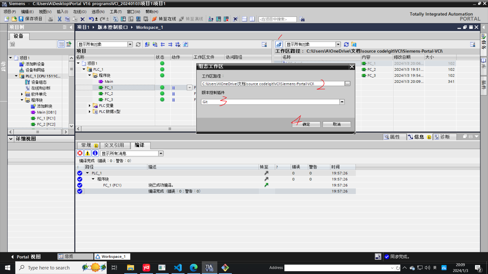

# Siemens-Portal-VCI

西门子PLC与Git结合

参考教程：[通过git控制博途程序版本_plc程序版本管理工具-CSDN博客](https://blog.csdn.net/njsrlb/article/details/121384596)

博途插件下载：[TIA Add-In - ID: 109773999 - Industry Support Siemens](https://support.industry.siemens.com/cs/document/109773999/tia-add-in?dti=0&lc=zh-CN)

# 1 心得

* 在git建立远程仓库，并在电脑硬盘期望的文件夹里，执行git bash here,  命令 git clone  '远程仓库的网址'，在该目录下生成.git文件
* 博途项目的文件位置   与   仓库的位置    是不同的文件夹 ，仓库的文件位置在博途里指定；

    

* WS左侧是本地PLC项目里的数据 ，右侧是仓库的数据
* 以FC1 为例 ，首先在博途新建它， 记得编译，  然后在左侧窗口中鼠标拖曳到右侧窗口，可以认为本地与仓库建立了映射 （可以使用vscode 打开.git所在目录查看，因为vscode有强大的git功能）
* 在右侧的FC1上右键 Git -- Add , 首次提交可能使用push
* git --status ,查看当前状态
* git -- log , 查看更改日志 ，这里面有唯一的提交识别码，以及自定义提示内容，这部分与 git--restore (回滚)有关
* 以上在右侧目标文件上右键都可以正常使用，除了git -- restore, 请按照上面参考网址里的介绍操作，试验有效
* 这个功能只在Portal V16 以上有用；
